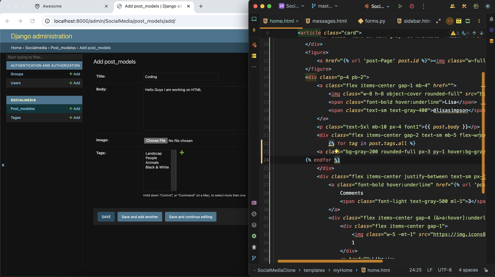
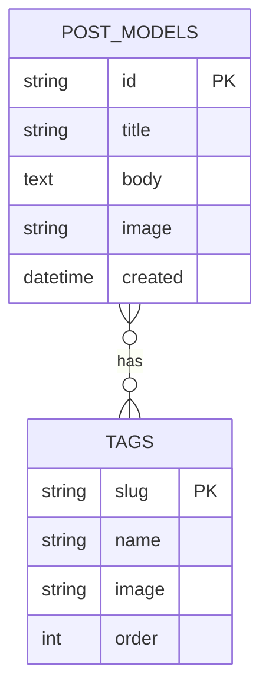

<div align="center">

# SocialMediaClone

### A Django-powered social feed app with categories, media posts, and auth flows


</div>

---

## Preview

> Main feed (from this repository assets):



---

## Table of Contents

- [Overview](#overview)
- [Core Features](#core-features)
- [Tech Stack](#tech-stack)
- [Project Architecture](#project-architecture)
- [Routes](#routes)
- [Quick Start](#quick-start)
- [Environment Setup](#environment-setup)
- [Development Commands](#development-commands)
- [Security Notes](#security-notes)
- [Roadmap](#roadmap)
- [Contributing](#contributing)

---

## Overview

`SocialMediaClone` is a Django web application focused on image-first posts with category tagging.  
It includes:

- Public feed with latest posts first
- Category/tag filtering via slug-based routes
- Post create, edit, delete, and detail pages
- Built-in auth pages through `django-allauth`
- Media upload support for post images and tag icons

---

## Core Features

| Feature | Status | Notes |
|---|---|---|
| Feed page | Implemented | `home/` route renders all posts |
| Category filtering | Implemented | `category/<tag>/` filters by tag slug |
| Post creation | Implemented | Image + title + caption + multi-tag form |
| Post editing | Implemented | Updates title/body/tags |
| Post deletion | Implemented | Confirmation + success flash |
| Post detail page | Implemented | Dedicated post page by UUID key |
| Authentication pages | Implemented | `accounts/` via `django-allauth` |

---

## Tech Stack

| Layer | Technology |
|---|---|
| Backend | Django 5.2 |
| Language | Python 3.10+ |
| Database | PostgreSQL (`psycopg2`) |
| Auth | `django-allauth` |
| API-related deps | `djangorestframework`, `simplejwt` (installed) |
| Media handling | Pillow |
| Templates | Django Templates |

---

## Project Architecture

```text
SocialMediaClone/
├── SocialMediaProject/        # Django project settings and root urls
├── SocialMedia/               # Main app (models, forms, views, urls)
├── templates/                 # UI templates (feed, post pages, auth pages)
├── static/                    # Static files
├── media/                     # Uploaded/local media
├── manage.py
└── requirements.txt
```

### App Data Model



---

## Routes

| Method | Route | Purpose |
|---|---|---|
| GET | `/home/` | Main feed |
| GET | `/category/<tag>/` | Filter posts by tag slug |
| GET/POST | `/post/create/` | Create a post |
| GET/POST | `/post/edit/<pk>/` | Edit an existing post |
| GET/POST | `/post/delete/<pk>/` | Delete a post |
| GET | `/post/<pk>/` | Single post page |
| GET/POST | `/accounts/...` | Auth/account flows (`allauth`) |
| GET | `/admin/` | Django admin |

---

## Quick Start

```bash
# 1) Clone and move into project
git clone <your-repo-url>
cd SocialMediaClone

# 2) Create virtual environment
python3 -m venv .venv
source .venv/bin/activate

# 3) Install dependencies
pip install --upgrade pip
pip install -r requirements.txt

# 4) Apply migrations
python manage.py migrate

# 5) Create admin user (optional)
python manage.py createsuperuser

# 6) Run development server
python manage.py runserver
```

Open: `http://127.0.0.1:8000/home/`

---

## Environment Setup

Create `.env` from `.env.example`:

```bash
cp .env.example .env
```

Current `settings.py` uses a local PostgreSQL configuration.  
Make sure your PostgreSQL instance matches these values or update settings:

- Database: `SocialMediaClone`
- User: `postgres`
- Host: `localhost`
- Port: `5432`

Example local database bootstrap (macOS/Homebrew):

```bash
brew install postgresql
brew services start postgresql
createdb SocialMediaClone
```

---

## Development Commands

```bash
# Run tests
python manage.py test

# Generate new migrations
python manage.py makemigrations

# Apply migrations
python manage.py migrate

# Collect static (production-like)
python manage.py collectstatic --noinput
```

---

## Security Notes

- Move hardcoded secrets and DB credentials out of `SocialMediaProject/settings.py` into environment variables.
- Set `DEBUG=False` in production.
- Restrict `ALLOWED_HOSTS` for deployed environments.
- Store media/static with production-ready storage if deploying publicly.

---

## Roadmap

- Add user profile ownership and per-user feeds
- Add likes/comments persistence
- Add REST API endpoints for mobile/client apps
- Add CI workflow (lint + tests on PR)
- Add Docker setup (`Dockerfile` + `docker-compose.yml`)

---

## Contributing

1. Fork the repository
2. Create a feature branch: `git checkout -b feat/your-feature`
3. Commit changes with clear messages
4. Open a pull request with screenshots and test notes

---

## License

No license file is currently defined in this repository.  
Add a `LICENSE` file (MIT/Apache-2.0/etc.) before public distribution.
